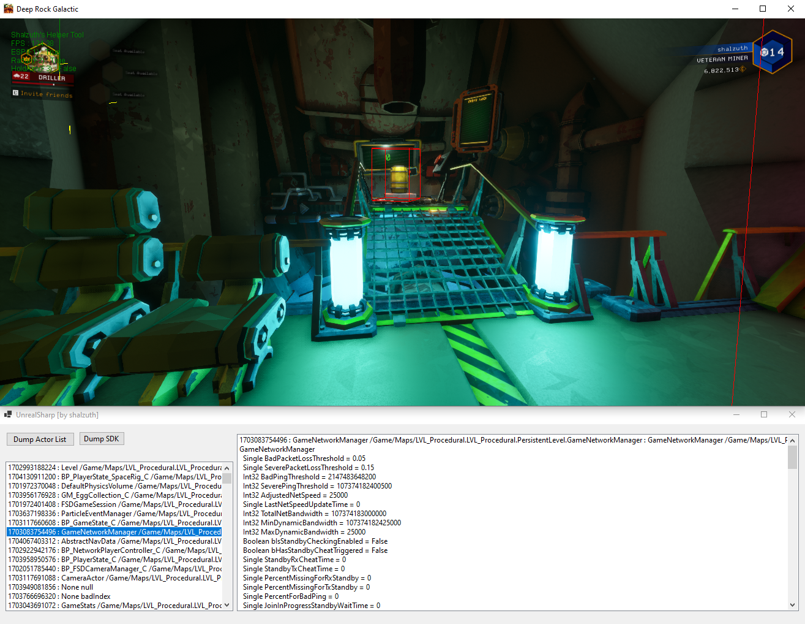

# UnrealSharp
 UnrealSharp is a helper framework to create extra sensory perception, radar, and other tools and game mods for UnrealEngine games.

# What is this and is it shiny?
 Unreal Sharp is written in C#, and works by using reading process memory. The framework is setup to be dynamic for multiple games, as well as being able to dynamically reference fields by name. While it is external, it is also one of, if not the only, external that can call internal functions.
 
# How does this work
 This project heavily relies on Unreal Engine's reflection system, using strings to dump out game info.
 
# Screenshot or it didn't happen
 

# Legal stuff
 shalzuth isn't endorsed by Epic Games and doesn’t reflect the views or opinions of Epic Games or anyone officially involved in producing or managing Epic Games content and materials are trademarks and copyrights of Epic Games